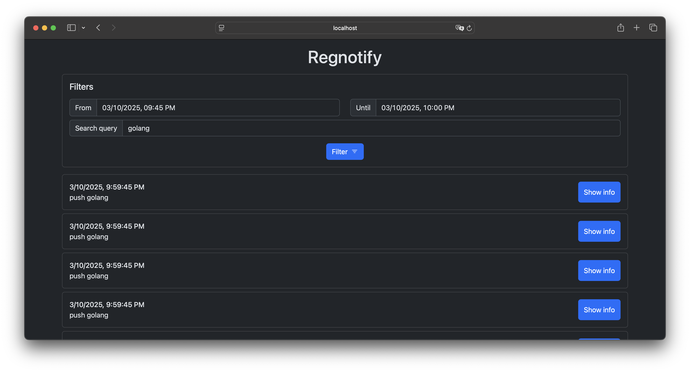

# regnotify
A simple application to handle and store [notifications sent by the distribution container registry](https://distribution.github.io/distribution/about/notifications/), and view them using a web interface/API.



- Simple web interface written with [Alpine](https://alpinejs.dev/) and [Bootstrap](https://getbootstrap.com/).
- Small JSON API to write/read/listen for events. Documentation can be found at [api/openapi.yaml](api/openapi.yaml).
- Uses [Bolt](https://github.com/etcd-io/bbolt) as the back-end storage for events.
- Utilizes Server-Sent Events to stream new events to your browser as they come in.

# Deployment
## Quick deployment using Docker Compose
For a quick 'batteries-included' setup including the registry itself, take a look at the [docker-compose.yml](docker-compose.yml) in this repository.  
To deploy it, run the following:
```shell
git clone https://github.com/evanebb/regnotify.git
cd regnotify
make docker
docker compose up -d
```

You can now access the application at `http://localhost:8000` or `http://<host-ip>:8000`.
If you push an image to the newly created registry instance, you should see some events appear in the application.

## With existing registry
### The application itself
This application is shipped as a container image, available at `ghcr.io/evanebb/regnotify`.

For example, to run it using Docker, use the following command:
```shell
docker run --name regnotify -d -p 8000:8000 -v regnotify_db_data:/var/lib/regnotify ghcr.io/evanebb/regnotify
```

It can now be accessed at `http://localhost:8000` or `http://<host-ip>:8000`.

### Registry configuration
In order to actually receive these events, your registry instance must be configured to send notifications to this container. The following is a very basic example snippet of the configuration:
```yaml
notifications:
  endpoints:
    - name: listener
      url: http://<regnotify-host-ip>:8000/api/v1/events
```

For a full, but very basic, registry configuration take a look at the [registry-config.yml](registry-config.yml) file in this repository.

Additionally, take a look at the [official registry documentation on how to configure it to send notifications](https://distribution.github.io/distribution/about/notifications/#configuration).
